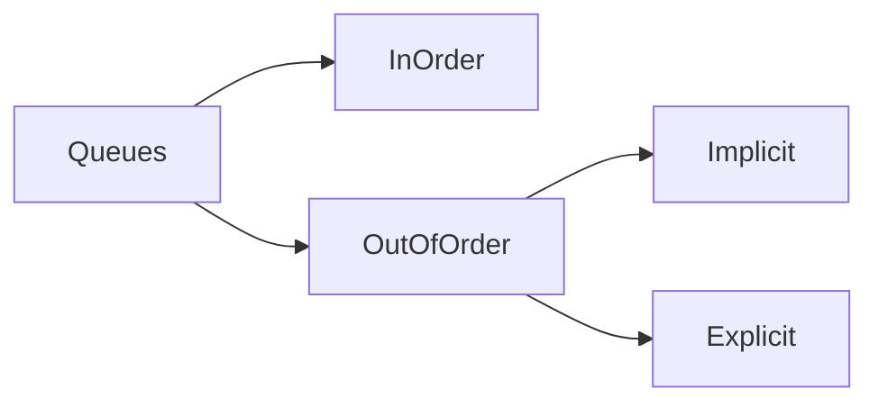

# Example 01: Queues

## Queues

### In-order

Queues are in nature out-of-order. In-order queues could be instantiated
with `sycl::queue q{my_device, sycl::property::queue::in_order()};`.

### Out-of-order

The out-of-order queues could infer ordering from **implicit** or **explicit** ordering. Implicit ordering is done using
Command
Groups.

#### Explicit Ordering

Is done using events, similar to that of CUDA and OpenCL. Each CG upon submission to a queue gets an event (returned
from `sycl::queue::submit()`).
This event could be used to define dependencies for latter CGs. Also, a blocking `wait()` could be called on an event to
make sure its CG has finished before proceeding on the host thread.
The dependencies could be defined with `handler.depends_on(event1);` within a CG. These could be used to construct
Computational Graph or Directed Acyclic Graph (DAG), just like non-eager execution in Tensorflow. If you are familiar
with CUDA or OpenCL these concepts should not feel strange.

#### Implicit Ordering

Is done simply by using `sycl::accessor`s for buffers and the programmer is not required to do anything extra.
Just use `my_buffer.get_access<access_t>(handler);` in CG with `const auto access_t = sycl::access::mode::write` or any
other element of that enum.
