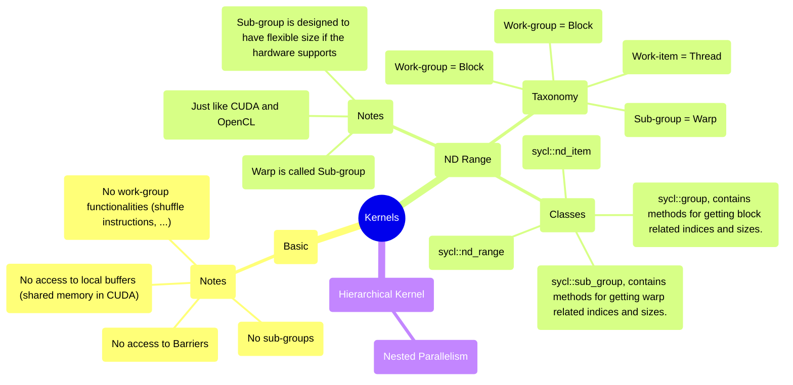

# Example 02: Kernels

## Kernels



## ND Range vs. CUDA

For a lambda ND kernel such as:

```
[=](sycl::nd_item<2> item) {
    ...
}
```

| CUDA                                  | SYCL                    |
|---------------------------------------|-------------------------|
| threadIdx.x                           | item.get_local_id(0)    |
| blockIdx.x * blockDim.x + threadIdx.x | item.get_global_id(0)   |
| blockIdx.x                            | item.get_group(0)       |
| blockDim.x                            | item.get_local_range(0) |
| gridDim.x                             | item.get_group_range(0) |

So, when `*range` is used as a suffix, it refers to that quantity's size. 
  
**Be careful when dealing with 2D and 3D blocks** and grids, since the axes are defined differently.  
For SYCL, we have `nd_item` where axis=0 is used as the most valuable axis while axis=-1 is used as the least valuable
axis. To put it into perspective, for CUDA, `threadIdx.x` is the least valuable axis, and `threadIdx.z` is the most
valuable axis.

