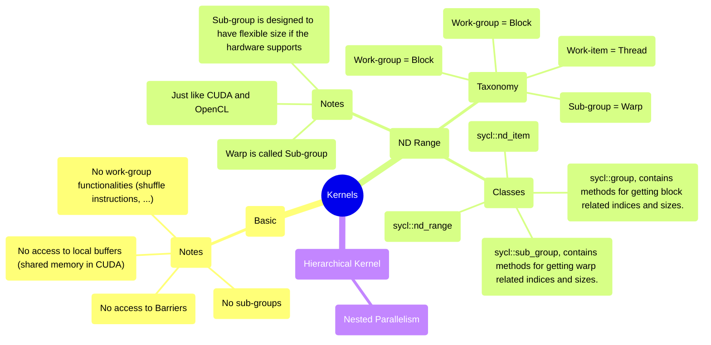

# Example 02: Kernels

## Kernels

```mermaid
mindmap
  root((Kernels)
    id(Basic)
      id("Notes")
        id("No access to local buffers (shared memory in CUDA)")
        id("No access to Barriers")
        id("No sub-groups")
        id("No work-group functionalities (shuffle instructions, ...)")
    id(ND Range)
      id(Notes)
        id(Just like CUDA and OpenCL)
        id(Warp is called Sub-group)
        id(Sub-group is designed to have flexible size if the hardware supports)
      id(Taxonomy)
        id("Work-item = Thread")
        id("Sub-group = Warp")
        id("Work-group = Block")
        id("Work-group = Block")
      id(Classes)
        id("sycl::nd_item")
        id("sycl::nd_range")
        id("sycl::group, contains methods for getting block related indices and sizes.")
        id("sycl::sub_group, contains methods for getting warp related indices and sizes.")
    id(Hierarchical Kernel)
      id(Nested Parallelism)

```

### 