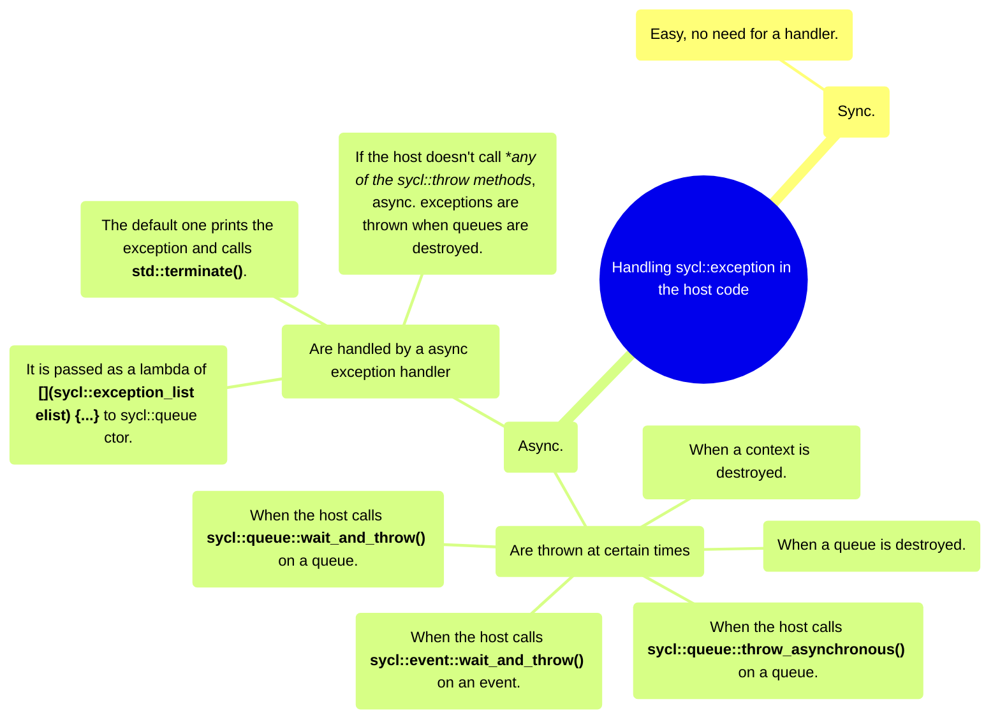

# Example 03: Exceptions!

```mermaid
mindmap
root(("Handling sycl::exception in the host code"))
    id("Sync.")
        id("Easy, no need for a handler.")
    id("Async.")
        id("Are thrown at certain times")
            id("When the host calls **sycl::queue::throw_asynchronous()** on a queue.")
            id("When the host calls **sycl::queue::wait_and_throw()** on a queue.")
            id("When the host calls **sycl::event::wait_and_throw()** on an event.")
            id("When a queue is destroyed.")
            id("When a context is destroyed.")
        id("Are handled by a async exception handler")
            id("It is passed as a lambda of **[](sycl::exception_list elist) {...}** to sycl::queue ctor.")
            id("The default one prints the exception and calls **std::terminate()**.")
            id("If the host doesn't call **any of the sycl::*throw methods**, async. exceptions are thrown when queues are destroyed.")
```
  
**SYCL prohibits exception handling mechanisms within device codes.**  

