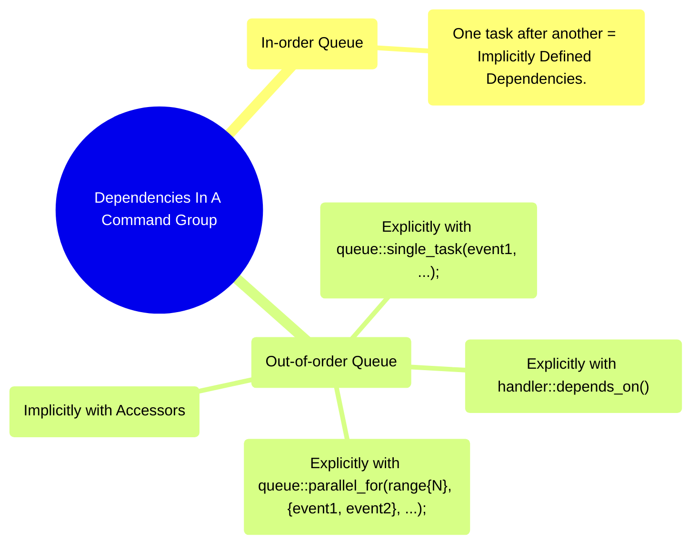
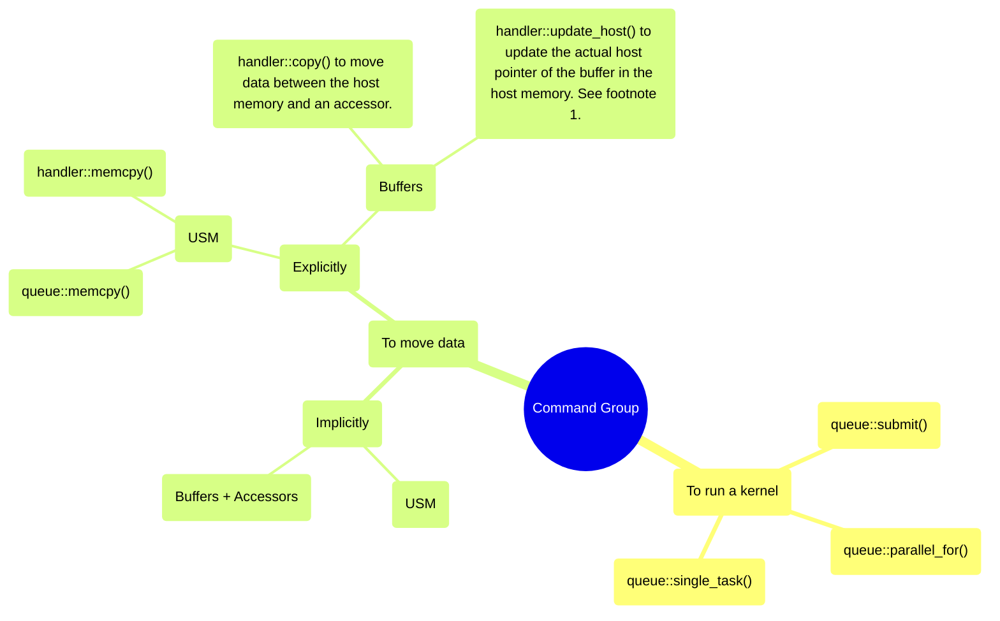
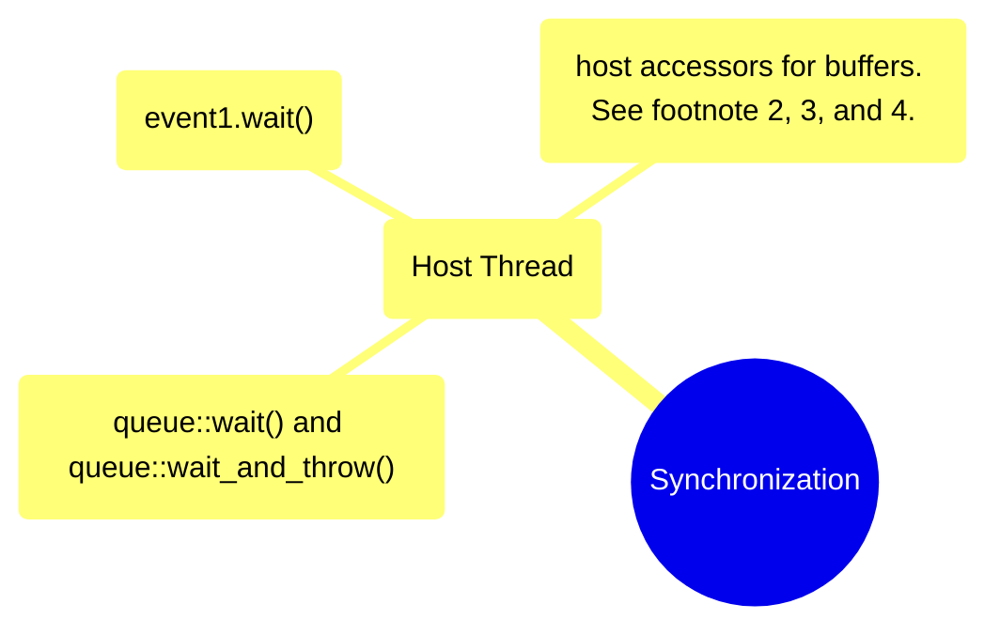

# Example 04: Dependencies and Schedule

1. From DPCPP book: *"The update_host method is a very specialized form of copy. If a buffer was created around a host pointer, this method will copy the data represented by the accessor back to the original host memory. This can be useful if a program manually synchronizes host data with a buffer that was created with the special use_mutex property. However, this use case is not likely to occur in most programs."*

2. From DPCPP book: *"Note that if the buffer was constructed from existing host memory, this original memory is not guaranteed to contain the updated values."*

3. Host accessors are blocking on the host thread. From DPCPP book: *"Note that host accessors are blocking. Execution on the host may not proceed past the creation of the host accessor until the data is available. Likewise, a buffer cannot be used on a device while a host accessor exists and keeps its data available. A common pattern is to create host accessors inside additional C++ scopes in order to free the data once the host accessor is no longer needed. This is an example of the next method for host synchronization. Host accessors can make data remain on the host until they are destroyed."*

4. From DPCPP book: *"Once a buffer is no longer being used by any kernel or memory operation, the runtime may have to copy data back to the host. This copy occurs either if the buffer was initialized with a host pointer or if a host pointer was passed to the method set_ final_data. The runtime will then copy back the data for that buffer and update the host pointer before the object is destroyed."*

**Read more** about buffers that are created with the option `use_mutex`.
