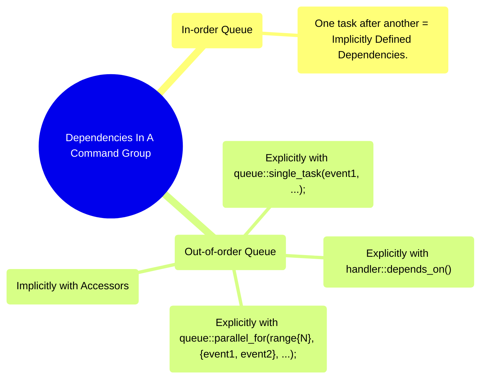

# Example 04: Dependencies and Schedule

```mermaid
mindmap
root(("Dependencies In A Command Group")
  id("In-order Queue")
    id("One task after another = Implicitly Defined Dependencies.")
  id("Out-of-order Queue")
    id("Explicitly with handler::depends_on()")
    id("Explicitly with queue::parallel_for(range{N}, {event1, event2}, ...);")
    id("Explicitly with queue::single_task(event1, ...);")
    id("Implicitly with Accessors")
```

