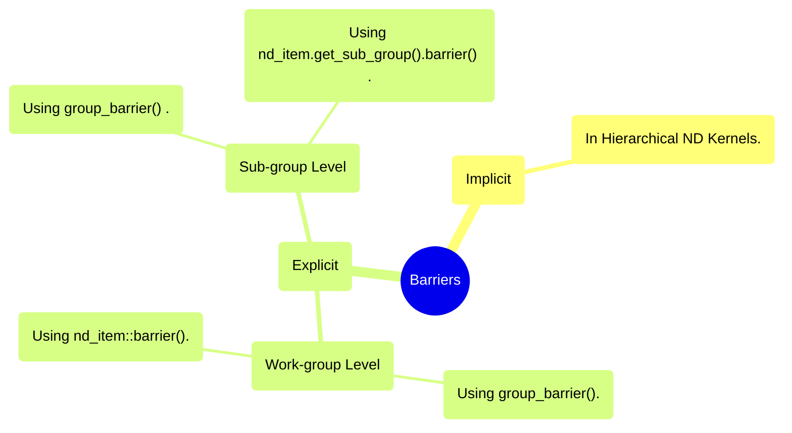

# Example 05: Barriers

## Overview

## Kernel Types and Barriers
### Task Kernels
We do not have barriers for Task kernel.

### ND-range Kernels
We have workgroup-level and subgroup-level barriers, just as in CUDA (block-level and warp-level barriers). Same like CUDA, a barrier in SYCL also deploys a fence mechanism.

### Hierarchical Kernel
We have implicit barriers for these kernels, meaning that the compiler inserts them based on the hierarchy of the kernel.  

## Collective Functions and Barriers
Collective functions are functions that perform something collectively using threads (work-items) in an specific level (warp or subgroup, block or workgroup).  
So, with the given definition, a barrier could also be considered a collective function. In addition, shuffle instructions, etc. could also be categorized as collective functions.

