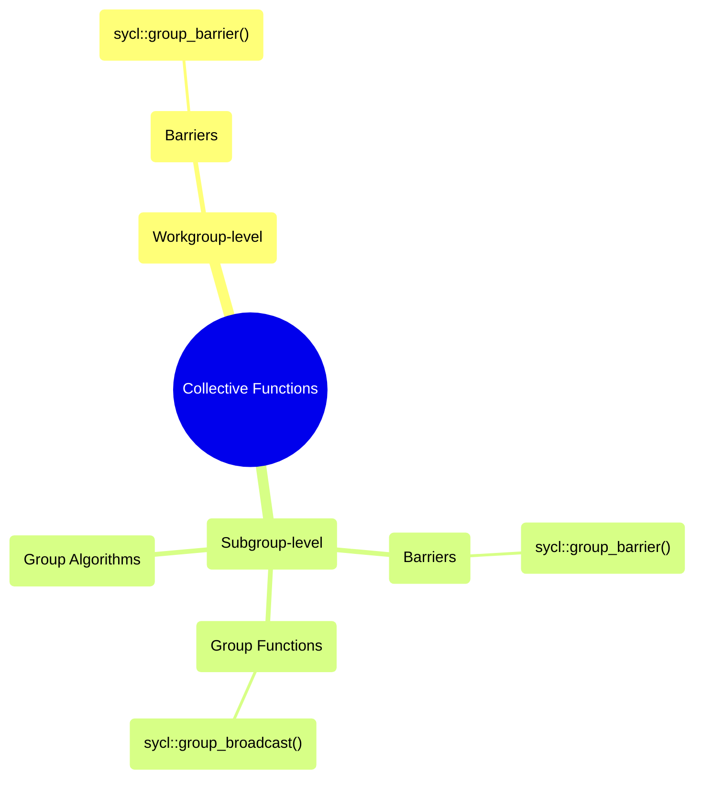
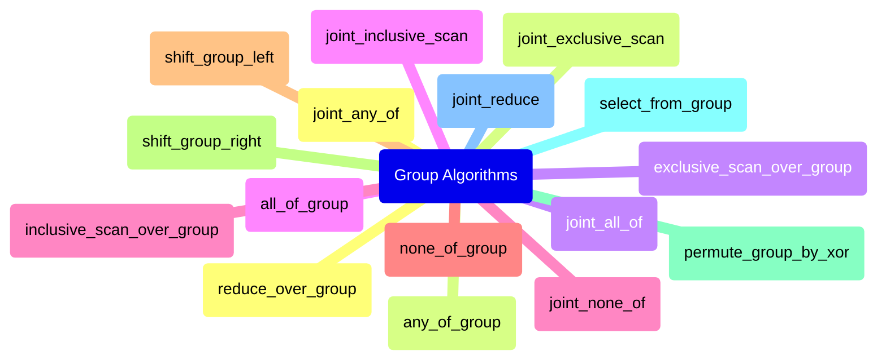

# Example 06: Collective Functions

## Overview 1

```mermaid
mindmap
root(("Collective Functions"))
  id("Workgroup-level")
    id("Barriers")
      id("sycl::group_barrier()")
  id("Subgroup-level")
    id("Barriers")
      id("sycl::group_barrier()")
    id("Group Functions")
      id("sycl::group_broadcast()")
    id("Group Algorithms")
```

## Overview 2

```mermaid
mindmap
root("Group Algorithms")
  id("joint_any_of")
  id("any_of_group")
  id("joint_all_of")
  id("all_of_group")
  id("joint_none_of")
  id("none_of_group")
  id("shift_group_left")
  id("shift_group_right")
  id("permute_group_by_xor")
  id("select_from_group")
  id("joint_reduce")
  id("reduce_over_group")
  id("joint_exclusive_scan")
  id("exclusive_scan_over_group")
  id("joint_inclusive_scan")
  id("inclusive_scan_over_group")
```

## Examples
TODO.
